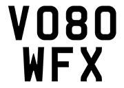
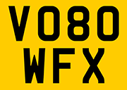
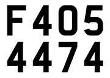
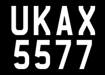

# VRPG

Vehicle Registration Plate Generator (VRPG) is open-source software for Vehicle registration plate generation.


Contents
========

* [Why?](#why)
* [Updates](#Updates)
* [Getting Started](#getting-started)
* [UK plates](#uk-plates)


## Why?

I wanted a tool that allows you to:

+ Improve ANPR dataset
+ Generate all types of UK registration plates

## Updates

[2024-10-06] VRPG v0.0.1 is released.
- United Kingdom Vehicle Registration Plate Generator.

## Getting Started

Supported countries:

| Country   | Font name                | Font link to download                                           | Reference                                                                                                          |
|-----------|--------------------------|-----------------------------------------------------------------|--------------------------------------------------------------------------------------------------------------------|
| UK        | Charles Wright           | [Link](https://www.k-type.com/fonts/charles-wright/)            | [Link](https://www.gov.uk/government/publications/vehicle-registration-numbers-and-number-plates)                  |

Please download the font file to create vehicle license plate. 
Upload this file to fonts directory or to any place. 

An example of usage with font name = None (create directory /fonts/ first, font file downloaded to the /fonts/ directory):

``` shell
from pg.generator import *


if __name__ == '__main__':
    result = vrpg(country='UK', font=None, directory='d:/temp/img/', dpi=150, plate_type='random')
    print(result)
```
The UK output images will be:


An example of usage with font name = absolute path:

``` shell
from pg.generator import vrpg


if __name__ == '__main__':
    result = vrpg(country='UK', font='F:/py/vrpg/fonts/CharlesWright-Bold.otf', directory='d:/temp/img/', dpi=150, plate_type='random')
    print(result)
```
## UK plates

Supported plate types

| Country   | Plate type               |
|-----------|--------------------------|
| UK        | 'random', 'Private', 'Motorcycle', 'Trade', 'Trailer', 'Diplomatic', 'Armed forces', 'Armed forces trailer'           |


 Plate type | Images               |
|-----------|--------------------------|
| 'Private'        |  | 
| 'Motorcycle'        |  | 
| 'Trade'        | | 
| 'Trailer'        | | 
| 'Diplomatic'        |  | 
| 'Armed forces'        | | 
| 'Armed forces trailer' | | 

