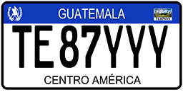
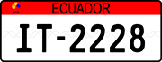

# VRPG

Vehicle Registration Plate Generator (VRPG) is open-source software for Vehicle registration plate generation.


Contents
========

* [Why?](#why)
* [Updates](#Updates)
* [Getting Started](#getting-started)
* [Argentina plates](#argentina-plates)
* [Bolivia plates](#bolivia-plates)
* [Chile plates](#chile-plates)
* [Guatemala plates](#guatemala-plates)
* [Ecuador plates](#ecuador-plates)
* [UK plates](#uk-plates)


## Why?

I wanted a tool that allows you to:

+ Improve ANPR dataset
+ Generate all types of Argentina registration plates
+ Generate all types of Bolivia registration plates
+ Generate all types of Chile registration plates
+ Generate all types of Guatemala registration plates
+ Generate all types of Ecuador registration plates
+ Generate all types of UK registration plates

## Updates

[2024-10-16] VRPG v0.0.4 is released.
- Bolivia, Argentina, Ecuador Vehicle Registration Plate Generator.

[2024-10-08] VRPG v0.0.3 is released.
- Chile Vehicle Registration Plate Generator.

[2024-10-07] VRPG v0.0.2 is released.
- Guatemala Vehicle Registration Plate Generator.

[2024-10-06] VRPG v0.0.1 is released.
- United Kingdom Vehicle Registration Plate Generator.

## Getting Started

Supported countries:

| Country   | Font name                | Font link to download                                           | Reference                                                                                                          |
|-----------|--------------------------|-----------------------------------------------------------------|--------------------------------------------------------------------------------------------------------------------|
| Argentina | FE-Schrift, Arial Narrow, Arimo-SemiBold, NotoSerif-Medium | [Link](https://www.andyhoppe.com/design/fonts/euro-plate-font/), [Link](https://online-fonts.com/fonts/arial-narrow/), [Link](https://fonts.google.com/specimen/Arimo/), [Link](https://fonts.google.com/noto/specimen/Noto+Serif/)  | [Link](https://www.guatecompras.gt/concursos/files/2259/11294345%40ESPECIFICACIONES%20TECNICAS%20PLACAS.pdf)       |
| Bolivia   | Roadgeek 2005 Series 1B, Traffic 02, Arial Narrow | [Link](https://fonts2u.com/roadgeek-2005-series-1b.font/), [Link](https://fonts2u.com/traffic-02.font/), [Link](https://online-fonts.com/fonts/arial-narrow/) | [Link](https://es.wikipedia.org/wiki/Matr%C3%ADculas_automovil%C3%ADsticas_de_Bolivia)                               |
| Chile     | FE-Schrift, Arial Narrow | [Link](https://www.andyhoppe.com/design/fonts/euro-plate-font/), [Link](https://online-fonts.com/fonts/arial-narrow/) | [Link](https://es.wikipedia.org/wiki/Matr%C3%ADculas_automovil%C3%ADsticas_de_Chile)                               |
| Guatemala | FE-Schrift, Arial Narrow | [Link](https://www.andyhoppe.com/design/fonts/euro-plate-font/), [Link](https://online-fonts.com/fonts/arial-narrow/) | [Link](https://www.guatecompras.gt/concursos/files/2259/11294345%40ESPECIFICACIONES%20TECNICAS%20PLACAS.pdf)       |
| Ecuador   | FE-Fschrift, Arial Narrow| [Link](https://www.andyhoppe.com/design/fonts/euro-plate-font/), [Link](https://online-fonts.com/fonts/arial-narrow/) | [Link](https://en.wikipedia.org/wiki/Vehicle_registration_plates_of_Ecuador)|
| UK        | Charles Wright           | [Link](https://www.k-type.com/fonts/charles-wright/)            | [Link](https://www.gov.uk/government/publications/vehicle-registration-numbers-and-number-plates)                  |

Please download the font files to create vehicle license plate. Upload these files to fonts directory. The font files are not included in the GitHub repository due to potential copyright concerns. 

An example of usage with font name = None (create directory /fonts/ first, font file downloaded to the /fonts/ directory):

``` shell
from pg.generator import *


if __name__ == '__main__':
    result = vrpg(country='UK', font=None, directory='d:/temp/img/', dpi=150, plate_type='random')
    print(result)
```
The UK output images will be:


An example of usage with font name = absolute path:

``` shell
from pg.generator import *


if __name__ == '__main__':
    result = vrpg(country='UK', font='F:/py/vrpg/fonts/CharlesWright-Bold.otf', directory='d:/temp/img/', dpi=150, plate_type='random')
    print(result)
```
## Argentina plates

Supported plate types

| Country   | Plate type               |
|-----------|--------------------------|
| Argentina | 'Vehículo privado', 'Cuerpo diplomático', 'Cuerpo consular', 'Organismos internacionales', 'Misiones especiales', 'Personal administrativo', 'Remolque', 'Vehiculos restricted', 'Trailer', 'RNPA', 'Motocicleta particular', 'Motocicleta restricted' |

| Plate type | Images               |
|-----------|--------------------------|
| 'Vehiculo privado' |  | 
| 'Cuerpo diplomático' |  | 
| 'Cuerpo consular' |  | 
| 'Organismos internacionales' |  | 
| 'Misiones especiales' |  | 
| 'Personal administrativo' |  | 
| 'Remolque' |  | 
| 'Vehiculos restricted' |  | 
| 'Trailer' |  | 
| 'RNPA' |  | 
| 'Motocicleta particular' |  | 
| 'Motocicleta restricted' |  | 


## Bolivia plates

Supported plate types

| Country   | Plate type               |
|-----------|--------------------------|
| Bolivia |'Vehiculo particular', 'Vehiculo MERCOSUR', 'Cuerpo consular', 'Cuerpo diplomatico', 'Mision internacional', 'Organizacion internacional'  |

| Plate type | Images               |
|-----------|--------------------------|
| 'Vehiculo particular' |  | 
| 'Vehiculo MERCOSUR' |  | 
| 'Cuerpo consular' |  | 
| 'Cuerpo diplomatico' |  | 
| 'Mision internacional' |  | 


## Chile plates

Supported plate types

| Country   | Plate type               |
|-----------|--------------------------|
| Chile | 'Vehiculo particular', 'Taxi básico', 'Taxi colectivo', 'Radiotaxi vehiculos de turismo', 'Buses de Transantiago', 'Vehículos adquiridos en Zona Franca', 'Remolques de peso bruto mayor a 3860kg', 'Remolques de peso bruto menor a 3860kg', 'Cuerpo diplomático', 'Vehiculos de carabineros', 'Inscripsion provisoria', 'Fuerzas Armadas', 'Bomberos' |

| Plate type | Images               |
|-----------|--------------------------|
| 'Vehiculo particular' |  | 
| 'Taxi básico' |  | 
| 'Taxi colectivo' |  | 
| 'Radiotaxi vehiculos de turismo' |  | 
| 'Buses de Transantiago' |  | 
| 'Vehículos adquiridos en Zona Franca' |  | 
| 'Remolques de peso bruto mayor a 3860kg' |  | 
| 'Remolques de peso bruto menor a 3860kg' |  | 
| 'Cuerpo diplomático' |  | 
| 'Vehiculos de carabineros' |  | 
| 'Inscripsion provisoria' |  | 
| 'Fuerzas Armadas' |  | 
| 'Bomberos' |  | 


 # Guatemala plates

Supported plate types

| Country   | Plate type               |
|-----------|--------------------------|
| Guatemala | 'Vehículo de alquiler', 'Vehículo Comercial', 'Cuerpo Consular', 'Cuerpo Diplomático', 'Misión Internacional', 'Vehículo Oficial', 'Vehículo Privado', 'Transporte Extraurbano de Personas o Carga', 'Bus urbano'|

 Plate type | Images               |
|-----------|--------------------------|
| 'Vehículo de alquiler' |  | 
| 'Vehículo Comercial' |  |
| 'Cuerpo Consular' |  |
| 'Cuerpo Diplomático' |  |
| 'Misión Internacional' |  |
| 'Vehículo Oficial' |  |
| 'Vehículo Privado' |  |
| 'Transporte Extraurbano de Personas o Carga' |  |
| 'Bus urbano' |  |

 # Ecuador plates

Supported plate types

| Country   | Plate type               |
|-----------|--------------------------|
| Ecuador | 'Vehículos comerciales', 'Vehículos gubernamentales', 'Vehículos de uso oficial', 'Vehículos de los gobiernos autónomos descentralizados', 'Vehículo privado', 'Vehículo privado duplicata', 'Vehículos de servicio diplomático', 'Matrícula temporal', 'Vehículos de internación temporal', 'Policía Nacional del Ecuador'|

 Plate type | Images               |
|-----------|--------------------------|
| 'Vehículos comerciales' |  | 
| 'Vehículos gubernamentales' |  | 
| 'Vehículos de uso oficial' |  | 
| 'Vehículos de los gobiernos autónomos descentralizados' |  | 
| 'Vehículo privado' |  | 
| 'Vehículo privado duplicata' |  | 
| 'Vehículos de servicio diplomático' |  | 
| 'Matrícula temporal' |  | 
| 'Vehículos de internación temporal' |  | 
| 'Policía Nacional del Ecuador' |  | 


## UK plates

Supported plate types

| Country   | Plate type               |
|-----------|--------------------------|
| UK        | 'random', 'Private', 'Motorcycle', 'Trade', 'Trailer', 'Diplomatic', 'Armed forces', 'Armed forces trailer'           |


 Plate type | Images               |
|-----------|--------------------------|
| 'Private'        |  | 
| 'Motorcycle'        |  | 
| 'Trade'        | | 
| 'Trailer'        | | 
| 'Diplomatic'        |  | 
| 'Armed forces'        | | 
| 'Armed forces trailer' | | 

